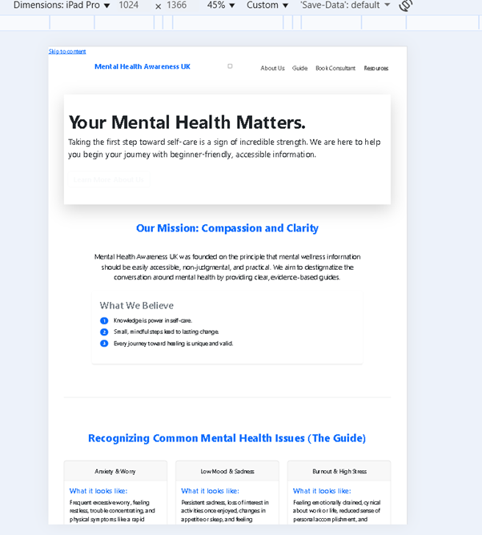
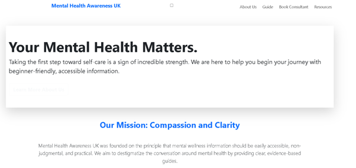
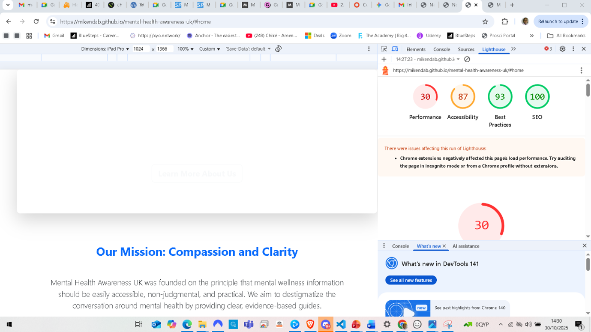

# 🧠 Mental Health Awareness — Front-End Web Development Project

## 📋 Project Overview

This project aims to design a **static front-end web application** using **HTML** and **CSS (Bootstrap)** to promote mental health awareness.  
It focuses on **user experience design, accessibility, and responsiveness**, using a calm, supportive colour scheme and semantic HTML structure.

### 🎯 Project Outcomes
- Design a static front-end web application using HTML and CSS.
- Apply user experience and accessibility principles.
- Test and deploy the website through all development stages.
- Use documentation and structure to ensure maintainability.
- Deploy the final site to a cloud platform (e.g., GitHub Pages).
- Demonstrate version control using GitHub.

---

## 🌍 Project Goals

### **External User’s Goal**
To find accessible, beginner-friendly information about mental health — including recognising common issues and managing stress — in a supportive and well-organised layout.

### **Site Owner’s Goal**
To create a welcoming, visually calming webpage that provides clear mental health information using only HTML, CSS, and Bootstrap.

---

## 💡 Project Features

### 1. Hero Section
- Positive messaging with an encouraging headline.
- Calming background colour (Soft Teal) and full-width image.
- CTA button: “Learn More About Us”.

### 2. About Us Section
- Mission statement: *“Our Mission: Compassion and Clarity.”*
- Paragraph explaining purpose and beliefs.
- Card with bulleted list of core beliefs:
  - Knowledge is power.
  - Small steps lead to change.

### 3. Mental Health Guide Section
- Headline: *“Recognizing Common Mental Health Issues.”*
- Responsive 3-column layout.
- Example cards:
  - **Anxiety & Worry** — symptoms and awareness.
  - **Low Mood & Sadness** — understanding depression.
  - **Burnout & High Stress** — signs and coping mechanisms.

### 4. Stress Management Techniques
- Headline: *“Beginner-Friendly Stress Management Techniques.”*
- Two responsive cards:
  - **Mindful Breathing** — step-by-step instructions.
  - **Gentle Movement** — light exercises and posture focus.

### 5. Positive Affirmations
- Soft yellow box with uplifting quotes.
- Visual accent: left border in Soft Teal.
- Reinforces positive emotional tone.

### 6. Consultation Form
- Headline: *“Request a Mental Health Consultation.”*
- Input fields:
  - Full Name (required)
  - Email (required)
  - Preferred Contact Method (dropdown)
  - Main Concern (textarea)
  - Privacy Checkbox
- On submission → navigates to `#thank-you` section.
- Disclaimer for static form (no server-side processing).

### 7. Thank You Section
- Message: *“Thank You For Taking This Step!”*
- Paragraph confirming request received.
- Note about 1–2 business day follow-up.

### 8. External Resources
- Headline: *“Find Professional Support and External Resources.”*
- Responsive button grid with links to WHO, NAMI, SAMHSA, etc.

### 9. Footer
- Two-column layout:
  - **Left:** brand name, address map, and disclaimer.
  - **Right:** quick links (Back to Top, Accessibility, Privacy Policy).
- Bottom line: copyright.

---

## 🎨 Design Details

### **Colour Palette**
| Purpose | Colour | Hex | Emotion/Effect |
|----------|---------|------|----------------|
| Primary (Highlights, Hero) | Soft Teal | `#6ABEA7` | Calm, trust, renewal |
| Secondary (Sections, Cards) | Sage Green | `#C6D7AF` | Peace, balance |
| Affirmations | Soft Yellow | `#FFE9A0` | Warmth, optimism |
| Links/Buttons | Dark Teal | `#378C76` | Depth, focus |
| Background | Off-White | `#F8F9FA` | Clean, minimal |
| Text | Dark Gray | `#212529` | Readable, neutral |
| Form Background | White | `#FFFFFF` | Clarity, cleanliness |

### **Typography and Layout**
- Font: `Inter, sans-serif`
- Semantic HTML (`<header>`, `<main>`, `<section>`, `<footer>`)
- Fully responsive using Bootstrap grid system.
- Accessibility: high-contrast colours and ARIA labels.

---

## 🧭 Navigation Structure

- **Home**
- **About**
- **Guide**
- **Book Consultation**
- **Resources**

All links are screen-reader accessible and use plain language.

---

## 👥 User Stories

1. As a first-time visitor, I want simple explanations of mental health conditions so I can recognise symptoms and seek help.
2. As a user managing stress, I want evidence-informed strategies to manage it.
3. As a concerned friend/family member, I want guidance on how to support someone struggling.
4. As a user with accessibility needs, I want clear headings and simple language for easy navigation.
5. As a user ready to take action, I want an easy-to-find booking form to contact professionals confidentially.

---

## ✅ Acceptance Criteria

- Navigation bar visible and accessible.
- Footer with contact info on all pages.
- Booking form with HTML5 validation.
- Sections for identifying stress issues.
- Clear, responsive design on all devices.

---

## 🧪 Testing

### **Responsiveness**
- ✅ Mobile tested

- ✅ iPad tested

- ✅ Desktop verified

### **Performance**
- Checked using Lighthouse (Chrome DevTools).

### **Validation**
- HTML validated via **W3C Validator**.
- CSS validated via **W3C CSS Validator**.

---

## ☁️ Deployment

- Hosted on **GitHub Pages**.
- Version controlled with **GitHub**.
- Static-only (no backend required).

---

## 🛠️ Technologies Used
- HTML5
- CSS3
- Bootstrap 5
- Git & GitHub

---

## 📄 License
This project is licensed for educational and portfolio use.

---

**Author:** *Michael Awanayah UK*  
**Project:** *Mental Health Awareness Front-End Web Application*

---
